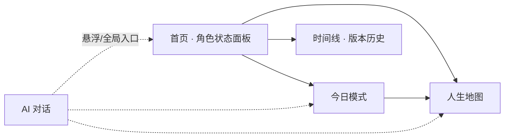
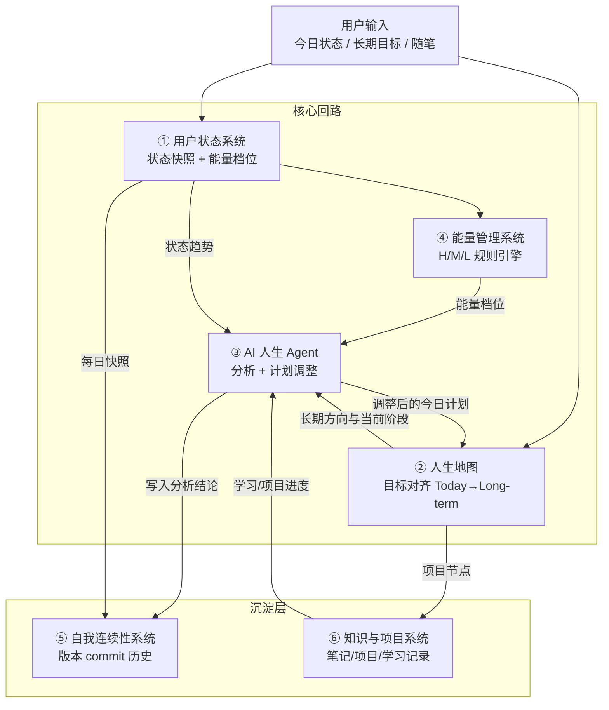

# LifeOS 产品架构（MVP 版）

> 角色：产品架构师 ｜ 版本：v0.1 ｜ 范围：MVP 可落地裁剪

## 1. 产品定位

**一句话陈述**：LifeOS 是一个以"自我连续性"为核心的 AI 人生操作系统——它把用户的长期方向、当前状态与每日行动放进同一个反馈回路，让系统在用户状态波动时自动调整节奏，而不是让用户去适应系统。

它不解决"事情做不完"，它解决"人在变化中迷失"。

## 2. 与传统效率工具的本质差异

| 维度 | 传统效率工具（Todo/日历/笔记） | LifeOS |
| --- | --- | --- |
| 管理对象 | 任务、时间、信息 | 人的状态、方向、能量、身份连续性 |
| 核心假设 | 用户是稳定的执行机器 | 用户是波动的生物体，状态随情境起伏 |
| 核心问题 | "今天要做什么？" | "我现在是谁？当前状态允许我做什么？" |
| 记录方式 | 清单勾选（完成/未完成） | 自我观察（描述，不打分）：如"创造力高，身体恢复不足" |
| 计划失效时 | 红色逾期、负罪感堆积 | 判定为恢复需求，切换低功耗模式，自动重排 |
| 长期视角 | 项目/截止日期 | 人生阶段→阶段目标→项目→日行动的纵向对齐 |
| 记忆 | 无（或仅搜索） | AI 长期记忆：理解过去经历、价值观、状态变化趋势 |
| 对"过去"的态度 | 已完成的任务沉入归档 | Git 式版本记录："过去的我不是消失了，而是更新了" |
| 失败反馈 | 鞭策、连续打卡、惩罚断签 | 系统主动降载，设计"允许崩溃也不重启"的结构 |

一句话概括差异：**Todo 工具优化"任务吞吐量"，LifeOS 优化"人的可持续运行"。**

## 3. 信息架构（五大页面）



| 页面 | 职责 | 关键内容 |
| --- | --- | --- |
| **首页 · 角色状态** | 回答"我现在是谁" | RPG 式角色面板：人生阶段、主要目标、能量档位（H/M/L）、身体/情绪/社交/创造/学习五维状态的描述性标签（如"身体恢复不足"），今日系统建议一句话 |
| **人生地图** | 回答"我往哪里走" | 多尺度星图：Long-term → Year → Month → Week → Today 纵向对齐；技能树式展开目标与项目的依赖关系 |
| **今日模式** | 回答"今天允许我做什么" | 当前能量模式卡片 + 当日的少量任务（≤3 件核心），展示 AI 基于状态调整后的计划及调整理由 |
| **时间线** | 回答"我如何走到今天" | Git commit 风格的版本历史：每条记录含"发生了什么 / 获得了什么 / 放弃了什么"，月度版本节点（如"2026 年 7 月版本"） |
| **AI 对话** | 全局陪伴与分析层 | 用户输入状态/倾诉，Agent 输出分析（非安慰）并执行动作（调整计划、写入状态、生成 commit） |

设计约束：AI 对话是**悬浮全局入口**，其余四页是"查看与确认"，对话页是"输入与协商"——保持信息架构扁平，五页以内，不做深层导航。

## 4. 六大模块数据流



**数据流解读**：
- ①与④是输入侧：状态快照驱动能量档位判定（规则引擎，MVP 不含模型）。
- ③是决策侧：Agent 读取「状态 + 能量 + 人生地图上下文」，输出「调整后的当日计划 + 一段分析」。
- ②是执行对齐层：保证"今日 3 件事"能向上追溯到长期方向。
- ⑤与⑥是沉淀层：一切变化落成可回看的版本记录与知识资产，构成自我连续性的证据链。

## 5. 前端架构（React SPA）

**技术栈**：React 18 + TypeScript + Vite + Zustand（状态管理）+ Tailwind CSS + Dexie.js（IndexedDB 封装）+ Mermaid/D3（地图可视化）。

### 5.1 组件分层

```
src/
├── pages/                # 五大页面（路由级）
│   ├── HomePanel/        # 角色状态面板
│   ├── LifeMap/          # 人生地图
│   ├── TodayMode/        # 今日模式
│   ├── Timeline/         # 版本时间线
│   └── AgentChat/        # AI 对话（全局 Drawer）
├── modules/              # 领域模块（六大模块对应的 UI + 领域逻辑）
│   ├── state/  map/  agent/  energy/  continuity/  knowledge/
├── engine/               # 规则引擎（纯函数，无 UI 依赖）
│   ├── energyRule.ts     # 状态 → 能量档位
│   ├── planAdjuster.ts   # 档位 + 目标 → 调整今日计划
│   └── analyzer.ts       # 文本状态 → 结构化标签
├── stores/               # Zustand stores（按模块拆分）
└── db/                   # Dexie schema + 持久化 DAO
```

### 5.2 状态管理方案

- **Zustand 按领域拆 store**：`useStateStore`（状态/能量）、`useMapStore`（目标树）、`useTimelineStore`（版本记录）、`useChatStore`（对话）。
- **单一事实来源在 IndexedDB**：store 只做内存镜像；所有写操作走 DAO 层，启动时 hydrate。
- **引擎纯函数化**：`engine/` 不碰 store，输入输出均为普通对象，便于单元测试，也便于未来整体迁移到后端。

### 5.3 核心数据结构（示意）

```ts
interface DailyState {
  date: string;                       // YYYY-MM-DD
  body: string; mind: string;         // 用户自述
  tags: StateTag[];                   // engine 解析出的标签，如 "身体恢复不足"
  energy: 'high' | 'medium' | 'low';  // 规则引擎判定
}

interface GoalNode {
  id: string; title: string;
  horizon: 'long' | 'year' | 'month' | 'week' | 'today';
  parentId?: string;                  // 纵向对齐链
  status: 'active' | 'done' | 'parked';
}

interface LifeCommit {                // ⑤自我连续性
  id: string; date: string;
  happened: string; gained: string; letGo: string;
  autoSummary?: string;               // Agent 生成
}
```

## 6. 后端架构：MVP 模拟 → 未来演进

### 6.1 MVP 阶段（无服务器）

- **持久化**：浏览器 IndexedDB（Dexie）。数据完全本地，导出为 JSON 备份。
- **Agent 模拟**：`engine/` 内的规则引擎扮演 Agent：
  1. `energyRule`：连续高强度天数、最近 N 天状态标签 → 判定 H/M/L；
  2. `planAdjuster`：低档位 → 当日任务裁剪至 1 件核心 + 恢复项，并生成解释文案（模板化，如"你已连续高强度工作 5 天，这更像恢复需求而非动力不足，建议进入低功耗模式"）；
  3. `analyzer`：关键词/正则把用户自述映射为状态标签。
- **边界设计**：所有规则引擎调用收敛在一个 `AgentGateway` 接口后面，前端永远只跟接口说话。

```ts
interface AgentGateway {
  analyzeState(input: DailyState): Promise<StateTag[]>;
  adjustPlan(ctx: AgentContext): Promise<PlanAdjustment>;
  summarizePeriod(range: DateRange): Promise<string>;
}
```

### 6.2 演进路径

| 阶段 | 触发条件 | 变化 |
| --- | --- | --- |
| V0 MVP | 现在 | 纯前端 + IndexedDB + 规则引擎，`AgentGateway` 本地实现 |
| V1 接入 LLM | 模板文案显生硬、标签误判率高 | `AgentGateway` 增加远程实现：调用 LLM API（用户自带 Key 或代理服务），规则引擎降级为兜底；其余代码零改动 |
| V2 云端同步 | 多设备需求出现 | 引入轻量后端（如 Supabase）：账户、PostgreSQL、行级安全；本地 IndexedDB 变为离线缓存 + 同步队列 |
| V3 长期记忆 | 数据积累 ≥ 3 个月 | 后端向量库存储状态/对话/commit 嵌入，Agent 检索历史上下文做趋势分析；规则引擎仅保留能量档位的确定性判定 |

**原则**：演进只替换 `AgentGateway` 与 DAO 的实现，不重写 UI 与领域模型——MVP 的架构债务被刻意限制在接口边界之内。

## 7. MVP 取舍清单

### 做（Must）
- 长期目标输入与四层对齐（Long-term → Year → Month → Today 的最小链路）
- 每日状态记录（两段自由文本 + 自动标签 + 能量档位判定）
- 规则引擎版 Agent：计划自动调整 + 模板化分析文案
- 今日模式页：按档位裁剪后的当日计划及调整理由
- 时间线：手动 + 半自动的 Life Commit 记录与回看
- 本地持久化 + JSON 导出

### 不做（Won't，本期明确排除）
- 不做真实 LLM 接入（用规则引擎模拟，接口预留）
- 不做账户体系、云同步、多端（纯本地单设备）
- 不做五维状态的精确量化打分/雷达图算法（描述性标签即可，避免"打分焦虑"）
- 不做日历视图、番茄钟、习惯打卡等传统效率功能
- 不做社交、分享、成就系统（防止变成另一种打卡工具）
- 不做知识库全文检索与双向链接（⑥模块 MVP 仅做"目标关联项目/笔记"的一层链接）
- 不做复杂星图渲染（地图用可展开的层级树 + 简单连线即可，视觉升级留到 V1）

## 8. 架构核心结论

LifeOS 的架构本质是**一个反馈回路而非一个工具箱**：状态输入 → 能量判定 → 计划调整 → 行动沉淀为版本历史 → 历史反哺 Agent 的下一步判断。MVP 的全部技术决策（本地持久化、规则引擎、接口隔离）都服务于一个目标——用最小成本验证这个回路是否真的能帮助用户保持自我连续性，而不是验证技术本身。
