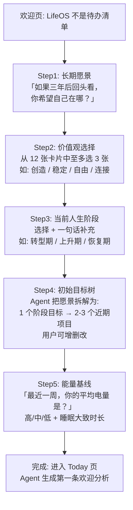
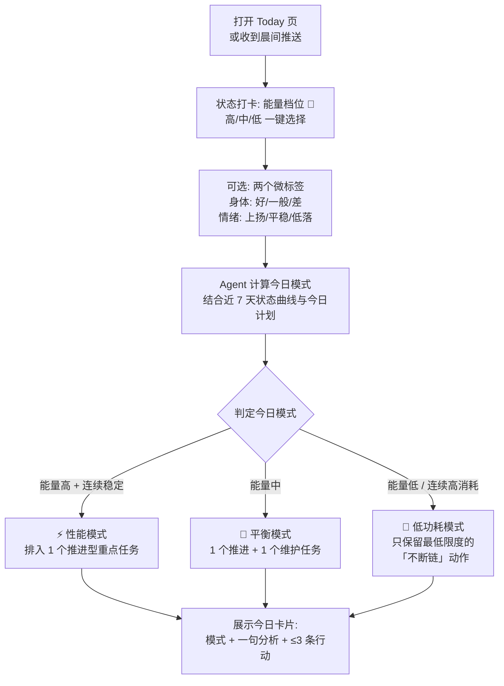
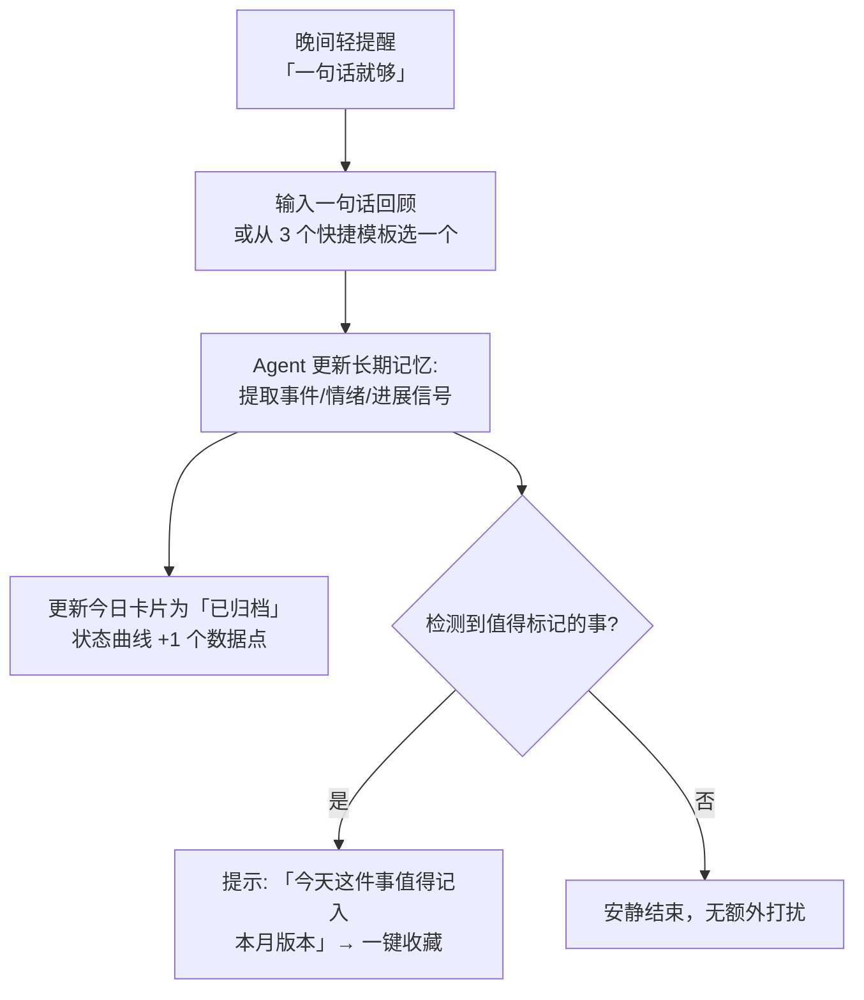
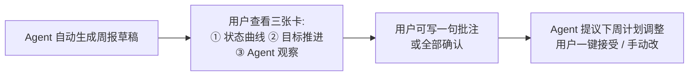
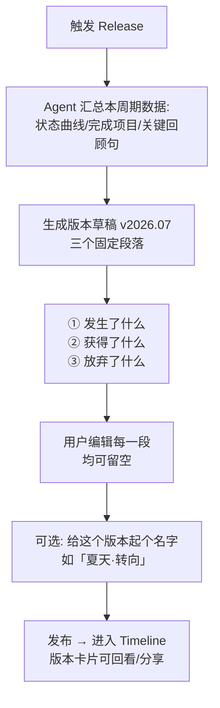
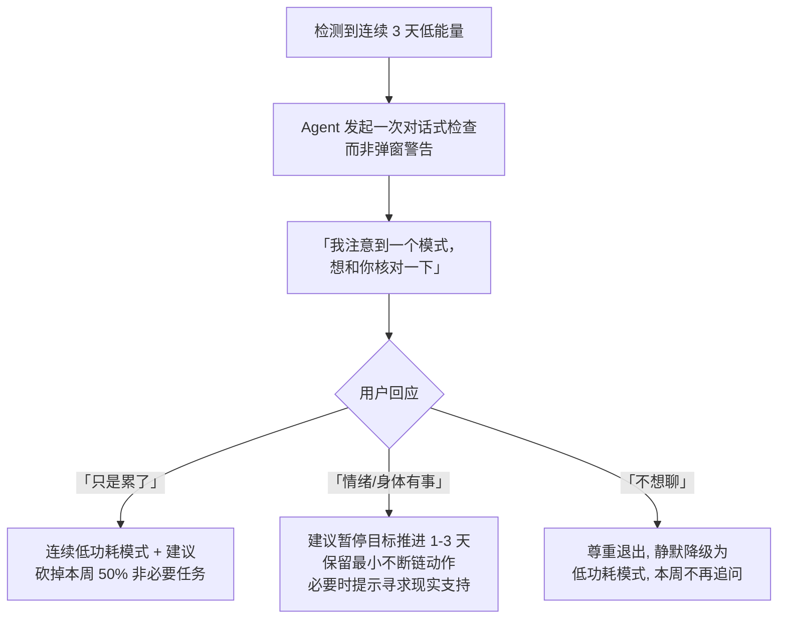
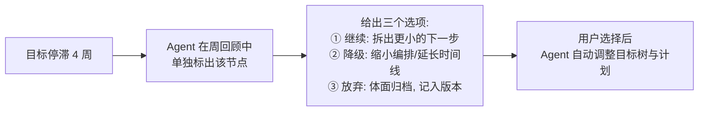
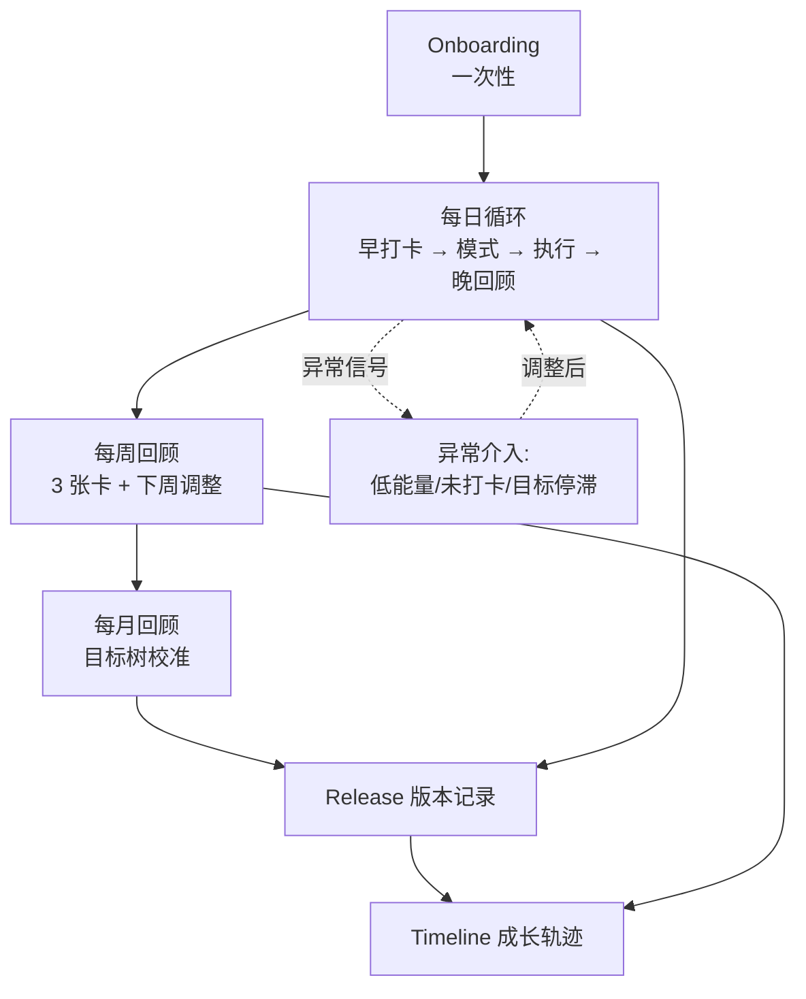

# LifeOS 用户体验流程（UX Flow）

> 版本：v1.0（MVP 裁剪版）
> 适用范围：MVP 五项能力 —— ①输入长期目标 ②每日记录状态 ③AI 理解变化 ④自动调整计划 ⑤查看成长轨迹
> 设计基调：**轻输入、重理解、允许波动**。所有流程默认用户处于"低动力"状态仍可完成。

---

## 0. 全局导航结构

MVP 仅保留 4 个一级入口，避免导航过载：

```
┌─────────────────────────────────────────┐
│  Today（默认首页）  Map   Timeline   Me │
└─────────────────────────────────────────┘
```

| 页面 | 职责 | 核心 UI 元素 |
|---|---|---|
| **Today** | 每日循环的主战场 | 状态打卡条、今日模式卡片、今日行动列表（≤3 条）、Agent 消息 |
| **Map** | 人生地图 / 目标树 | 长期方向节点 → 阶段目标 → 近期项目 → 今日行动的纵向连线 |
| **Timeline** | 成长轨迹与版本历史 | 时间轴、状态曲线、Release 版本卡片 |
| **Me** | 角色面板与设置 | 人生阶段、价值观标签、能量/身体/情绪等状态条、通知设置 |

---

## 1. 首次 Onboarding 流程（≤5 步）

目标：在 **3 分钟内**建立 Agent 的初始记忆与最小目标树。原则：**每一步只问一个问题，都可以跳过**（跳过则生成占位节点，日后再补）。



各步骤关键 UI 元素：

| 步骤 | 关键 UI | 备注 |
|---|---|---|
| Step1 长期愿景 | 大文本框（引导文案 + 3 个示例）、「还没想好」跳过按钮 | 愿景存入长期记忆，作为一切建议的对齐锚点 |
| Step2 价值观 | 卡片多选网格（图标 + 一词 + 一句话解释） | 最多选 3，制造取舍感 |
| Step3 当前阶段 | 横向阶段选择器（探索/建设/转型/恢复/维持）+ 可选输入框 | 阶段决定 Agent 的默认语气与节奏 |
| Step4 目标树 | 可编辑的树形卡片：方向 → 阶段目标 → 项目，每项可「改名 / 删除 / 添加」 | **Agent 起草、用户确认**，不让用户面对空白 |
| Step5 能量基线 | 三档滑块（🔋高/中/低）+ 睡眠简选 | 作为能量管理系统的初始校准 |

**完成态反馈**：Today 页展示 Agent 第一条消息——
> 「我记住了：你正处在转型期，最看重『创造』，未来想走向 3D AI 研究。今天的建议从一个小行动开始：读那篇你收藏了很久的论文的摘要即可。」

---

## 2. 每日循环流程（核心闭环）

### 2.1 早晨循环（< 30 秒打卡）



**打卡界面关键 UI 元素**：
- 顶部：**今日日期 + 连续记录天数**（不显示" streak 断裂惩罚"式红色警示）
- 中部：**三档能量大按钮**（默认聚焦，单手可达），身体/情绪标签折叠为可选项
- 底部：**今日模式卡片**（模式图标 + Agent 一句分析 + 行动列表），每条行动右侧有「完成 / 推迟 / 删掉」三个手势

**Agent 消息示例**（用户打卡"低能量"）：
> 「你已连续高强度工作 5 天，这更像恢复需求而非动力不足。今天进入低功耗模式：只保留『背 10 个单词』这一个不断链动作，其余两项已自动顺延。这不是退步，是系统在保护你的续航能力。」

### 2.2 日间执行

- 行动完成 → 轻量反馈（勾选 + 一句不夸张的确认，如「+1，今日主线已推进」）。
- **不做事不惩罚**：未完成任务静默顺延，Agent 只在晚间回顾中提及一次。

### 2.3 晚间循环（< 20 秒）



**晚间界面关键 UI 元素**：单行输入框 + 3 个模板胶囊（「今天推进了…」「今天很难，因为…」「今天只想躺平」）、今日完成度极简小结（不使用百分比分值）。

---

## 3. 每周 / 每月回顾流程

### 3.1 每周回顾（周日晚，约 3 分钟）



三张卡片的关键 UI：
1. **状态曲线卡**：7 天能量折线（三档色块），叠加睡眠/情绪微标记；
2. **目标推进卡**：目标树上本周动过的节点高亮，附「推进 / 停滞 / 主动放弃」状态标签；
3. **Agent 观察卡**：1-2 条模式洞察，如「你的低能量日都排在周三之后，可能与周二晚的固定加班有关」。

### 3.2 每月回顾（约 5 分钟）

在周报三张卡基础上增加两项：

- **目标树校准**：Agent 标出「连续 4 周无进展」的节点，提供三个选项——**继续 / 降级（缩小编排）/ 主动放弃**。放弃被显式设计为正当操作（记入版本，不扣分）。
- **版本预告**：「本月可合入一个版本，是否生成？」→ 进入第 4 节的 Release 流程。

---

## 4. 人生版本记录（Release）流程

### 4.1 触发时机

| 触发方式 | 条件 | MVP 是否实现 |
|---|---|---|
| 定期触发 | 每月回顾时由 Agent 提议 | ✅ |
| 事件触发 | 用户标记「里程碑事件」（如完成项目、换工作、结束一段关系） | ✅ |
| 手动触发 | Timeline 页随时可点「记录一个版本」 | ✅ |
| 自动检测 | Agent 发现人生阶段关键词变化（如「我辞职了」）→ 询问是否标记 | ✅（仅询问，不自动建） |

### 4.2 生成流程



**版本卡片关键 UI 元素**：版本号（`v2026.07`）、用户命名、三段正文、周期内状态曲线缩略图、关联的目标树变更 diff（新增 / 完成 / 放弃的节点，借鉴 Git commit 的 +/- 表达）。

**文案基调**（写在卡片底部，固定展示）：
> 「过去的我没有消失，只是更新到了下一个版本。」

---

## 5. 关键异常流程（Agent 介入策略）

总原则：**介入 = 提出观察 + 给出选项，永远不由 Agent 单方面改计划超过一步；语气像系统诊断，不像说教。**

### 5.1 连续低能量（≥3 天打卡「低」）



### 5.2 长期未打卡（≥5 天无记录）

- 第 5 天：一条**无 guilt 文案**的轻推送——「不用补卡。如果现在方便，一个电量表情就够。」
- 第 10 天：Agent 发一条「重逢消息」：总结中断前的人生地图状态，给出**一键恢复**按钮（「从中断前的计划继续」/「重新校准」）。
- **禁止**：连续天数清零的红色警示、"你输了"式游戏化惩罚。

### 5.3 目标停滞（某目标 ≥4 周无任何推进动作）



**示例消息**：
> 「『成为 3D AI 研究者』已经 4 周没有动作了。这通常意味着三种情况之一：它太大了、时机不对、或者它不再是你想要的了。哪个更接近？」

---

## 6. 流程间的关系（全景图）



**记忆与数据的流动**：打卡/回顾 → Agent 长期记忆 → 影响模式判定与计划调整 → 沉淀为周报/月报 → 合入 Release → 构成 Timeline。用户在所有环节只做**轻输入与确认**，Agent 承担汇总、诊断与重组。

---

## 7. MVP 裁剪说明（明确不做的）

| 不做项 | 理由 |
|---|---|
| 积分/等级/排行榜 | 与"不鼓励无限自律"原则冲突 |
| 多人社交、监督打卡 | MVP 聚焦自我连续性，社交对比有害 |
| 复杂的情绪量表（如 1-10 打分） | 违背"自我观察而非打分"原则，三档足够 |
| 技能树完整可视化 | Map 页先用目标树连线，星图/技能树留待 v2 |
| 自动创建 Release | 版本必须有用户确认环节，避免"被总结"的失控感 |
