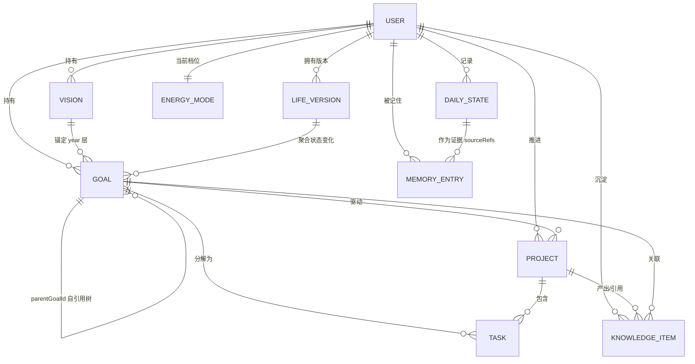

# LifeOS 数据模型设计（MVP）

> 版本：v0.1 · 面向 MVP 裁剪
> 定位：本文档定义 LifeOS 的完整实体模型、字段语义、实体关系、目标四层对齐机制、状态表示方式与存储方案。MVP 阶段以 localStorage 落地，接口设计上为未来数据库/云同步预留路径。

---

## 1. 设计原则

1. **状态不是分数**：所有"人"的维度用「定性标签 + 趋势方向 + Agent 自然语言解读」三元组表示，杜绝单一数值打分（数值只作为轻量辅助，不展示为"成绩"）。
2. **目标是树，不是列表**：Goal 分 year / month / week / day 四层，自下而上对齐到 Vision（长期方向），任一 Goal 必须能回答"它服务于谁"。
3. **人生是版本流，不是日志堆**：LifeVersion 以 Git commit 语义记录"发生了什么 / 获得了什么 / 放弃了什么"，支撑自我连续性。
4. **MVP 不过度设计**：不引入关系型多表复杂约束，所有实体为 JSON 文档，用 `id` 引用关联；能量模式、记忆条目等保持最小可用字段。

---

## 2. 实体总览

| 实体 | 职责 | 关键关联 |
|---|---|---|
| User | 用户身份与全局设置 | 1—n 其他所有实体 |
| Vision | 长期人生方向（3-5 年级） | → year Goal |
| Goal | 多尺度目标（year/month/week/day） | 自引用树 + Vision/Project |
| Project | 项目/作品集容器 | ↔ Goal、KnowledgeItem |
| DailyState | 每日五维状态记录 | → EnergyMode 建议 |
| EnergyMode | 能量档位（High/Med/Low） | 影响 Task 排程 |
| Task | 可执行行动（最小单位） | → Goal(day)、Project |
| LifeVersion | 人生版本记录（月度 commit） | 聚合 DailyState/Goal 变化 |
| MemoryEntry | Agent 长期记忆（事实/洞察/模式） | 引用任意实体 |
| KnowledgeItem | 笔记/论文/想法/学习记录 | ↔ Project、Goal |

---

## 3. 实体定义（TypeScript Interface）

### 3.1 User

```typescript
interface User {
  id: string;                    // UUID
  name: string;                  // 称呼
  createdAt: string;             // ISO 8601
  currentEnergyMode: EnergyLevel; // 当前能量档位（见 3.5）
  lifeStageTag?: string;         // 人生阶段定性标签，如 "职业转换期"、"探索期"
  settings: {
    timezone: string;
    checkInReminderTime?: string; // 每日状态记录提醒时间，如 "21:30"
  };
}
```

**字段语义**：`lifeStageTag` 是定性描述而非枚举打分，由用户自述 + Agent 归纳共同维护；`currentEnergyMode` 由用户声明或 Agent 建议修改（见能量管理系统）。

### 3.2 Vision（长期方向）

```typescript
interface Vision {
  id: string;
  userId: string;
  title: string;           // 如 "成为 3D AI 研究者"
  narrative: string;       // 自然语言描述：为什么是这个方向
  horizon: '3y' | '5y' | 'life';
  status: 'active' | 'paused' | 'archived';
  createdAt: string;
  updatedAt: string;
}
```

**字段语义**：Vision 不设 deadline、不设进度百分比——它是"北极星"，不是 KPI。`narrative` 供 Agent 在做计划调整时做语义对齐判断。

### 3.3 Goal（多尺度目标树）

```typescript
type GoalScale = 'year' | 'month' | 'week' | 'day';

interface Goal {
  id: string;
  userId: string;
  scale: GoalScale;
  title: string;
  parentGoalId?: string;   // 上层目标 id；year 层可指向 Vision
  visionId?: string;       // 仅 year 层必填，实现 vision→year 锚定
  period: string;          // "2026" | "2026-07" | "2026-W28" | "2026-07-09"
  status: 'planned' | 'active' | 'done' | 'dropped' | 'deferred';
  outcomeNote?: string;    // 结束时的定性复盘，如 "完成70%，方向验证成功"
  createdAt: string;
}
```

**字段语义**：四层对齐通过 `visionId` + `parentGoalId` 链实现（详见第 5 节）。`status: 'dropped'` 是合法且被鼓励的终态——放弃也是版本信息，会进入 LifeVersion。

### 3.4 Project

```typescript
interface Project {
  id: string;
  userId: string;
  title: string;            // 如 "NeRF 复现实验"
  goalIds: string[];        // 服务的 Goal（通常 month/year 层）
  status: 'idea' | 'active' | 'shipped' | 'parked';
  outputLinks?: string[];   // 作品集链接/GitHub 等
  createdAt: string;
}
```

### 3.5 DailyState 与 EnergyMode

```typescript
type EnergyLevel = 'high' | 'medium' | 'low';

// 五维状态的单维表示：定性标签 + 轻度量化 + 趋势
interface DimensionState {
  tag: string;              // 定性标签，如 "恢复不足"、"心流频发"
  level?: 1 | 2 | 3 | 4 | 5; // 轻度自评（可选，不展示为分数榜）
  note?: string;            // 用户一句话描述
}

interface DailyState {
  id: string;
  userId: string;
  date: string;             // "2026-07-09"
  body: DimensionState;     // 身体
  emotion: DimensionState;  // 情绪
  social: DimensionState;   // 社交
  creation: DimensionState; // 创造
  learning: DimensionState; // 学习
  freeText?: string;        // 自由记录，如 "今天很累"
  agentReading?: string;    // Agent 自然语言解读（见第 6 节）
  suggestedMode?: EnergyLevel; // Agent 建议的能量档位
}

interface EnergyMode {
  userId: string;
  current: EnergyLevel;
  effectiveFrom: string;    // 本档位生效日期
  reason: string;           // 切换原因（用户声明或 Agent 建议）
  history: Array<{ level: EnergyLevel; from: string; to?: string; reason: string }>;
}
```

**字段语义**：EnergyMode 类比电脑"性能/平衡/省电"模式。`low` 模式下系统自动削减 day Goal 数量、只保留维持性任务，避免"过度消耗→崩溃→重启"循环。

### 3.6 Task

```typescript
interface Task {
  id: string;
  userId: string;
  title: string;
  goalId: string;           // 所属 day Goal（强制对齐，杜绝无源任务）
  projectId?: string;
  energyCost: 'low' | 'medium' | 'high'; // 预估消耗，供低功耗模式过滤
  status: 'todo' | 'done' | 'skipped';
  date: string;             // 计划执行日
  isMaintenance?: boolean;  // 维持性任务（低功耗模式下仍保留）
}
```

### 3.7 LifeVersion（人生版本记录）

```typescript
interface LifeVersion {
  id: string;
  userId: string;
  versionTag: string;       // "2026-07" 或用户命名 "gap-month-v1"
  period: { from: string; to: string };
  happened: string[];       // 发生了什么（关键事件）
  gained: string[];         // 获得了什么（能力/作品/关系）
  released: string[];       // 放弃了什么（目标/执念/身份）
  summary: string;          // Agent 生成的版本小结
  statsSnapshot?: {         // 轻量聚合，非打分
    activeDays: number;
    dominantEmotionTag?: string;
    modeChanges: number;
  };
  createdAt: string;
}
```

**字段语义**：Git commit 语义——"过去的我不是消失了，而是更新了"。`released` 与 `gained` 同等重要。

### 3.8 MemoryEntry（Agent 长期记忆）

```typescript
type MemoryKind = 'fact' | 'insight' | 'pattern';

interface MemoryEntry {
  id: string;
  userId: string;
  kind: MemoryKind;
  // fact:    客观事实，如 "用户对咖啡因敏感，下午喝咖啡会失眠"
  // insight: 综合洞察，如 "创造力高峰与充足睡眠强相关"
  // pattern: 重复模式，如 "连续高强度 5 天后必然进入低能量"
  content: string;          // 自然语言一条
  sourceRefs: string[];     // 证据来源：DailyState/Goal/Task 的 id 列表
  confidence: 'low' | 'medium' | 'high'; // pattern 需多次观察才升级
  firstSeenAt: string;
  lastConfirmedAt: string;  // 最近被新证据确认的时间
  active: boolean;          // 失效记忆归档而非删除
}
```

### 3.9 KnowledgeItem

```typescript
interface KnowledgeItem {
  id: string;
  userId: string;
  type: 'note' | 'paper' | 'idea' | 'learning-log';
  title: string;
  content: string;          // Markdown 正文
  goalIds: string[];        // 服务的目标（Agent 自动关联 + 用户确认）
  projectIds: string[];
  createdAt: string;
}
```

**关联示例**：Vision "成为 3D AI 研究者" → KnowledgeItem（NeRF 论文笔记）→ Project（复现实验）→ 作品集 → 职业机会，全链路通过 `goalIds/projectIds` 可追溯。

---

## 4. 实体关系图（Mermaid ER）



---

## 5. 目标四层对齐设计

```
Vision "成为 3D AI 研究者"          ← 方向层（无 deadline）
  └─ year Goal  "2026：发表 1 篇 workshop 论文"      (visionId 锚定)
      └─ month Goal "7月：完成 NeRF 复现 + baseline"  (parentGoalId)
          └─ week Goal "W28：跑通官方代码训练"        (parentGoalId)
              └─ day Goal  "7/9：配置环境 + 数据集"   (parentGoalId)
                  └─ Task   "安装依赖 / 下载数据集"    (goalId)
```

**规则**：

- 每个 Goal 的 `parentGoalId` 只能指向相邻上层（day→week→month→year），year 层额外持有 `visionId`。
- **对齐校验**：创建 day/week Goal 时若找不到 parent，前端提示"这个行动服务于什么？"——允许临时悬空，但 Agent 会在周复盘时提醒收敛。
- **向上滚动复盘**：week 结束时，子 Goal 的 `outcomeNote` 聚合为 month 复盘的输入；LifeVersion 按月聚合整条链的 done/dropped/deferred 变化。
- **断链合法**：`status: 'dropped'` 的目标保留在树中并标记，成为 LifeVersion 的 `released` 素材，而不是被删除。

---

## 6. 状态的非分数化表示

DailyState 的每一维是三元组，展示层永远是「标签 + 趋势 + 解读」：

| 维度 | 定性 tag（示例） | level 趋势 | Agent 解读（agentReading） |
|---|---|---|---|
| 身体 body | "恢复不足" | 3 → 2 ↓ | — |
| 情绪 emotion | "平稳偏低" | 3 → 3 → | — |
| 社交 social | "低功耗" | 2 → 2 → | — |
| 创造 creation | "心流频发" | 4 → 5 ↑ | — |
| 学习 learning | "高效吸收" | 4 → 4 → | — |
| **综合** | — | — | "最近创造力很高，但身体恢复不足。你已连续高强度工作 5 天，这更像恢复需求而非动力不足，建议进入低功耗模式。" |

**关键设计**：

- `level` 仅供趋势计算（近 7 日移动方向 ↑/→/↓），UI 不渲染为分数、不做维度间排名。
- `agentReading` 由 Agent 基于本日记录 + MemoryEntry 中的 pattern 生成，是状态系统的核心输出。
- 趋势判定只需 level 序列，无需复杂统计：`mean(last3) - mean(prev3)` 的符号即可。

---

## 7. 存储方案与同步策略

### 7.1 MVP：localStorage

```
localStorage key 规划（单用户，前缀隔离）：
lifeos:user                    → User
lifeos:visions                 → Vision[]
lifeos:goals                   → Goal[]        （树结构用 id 引用，不嵌套）
lifeos:tasks                   → Task[]
lifeos:dailystates             → Record<date, DailyState>  （按日期索引）
lifeos:energymode              → EnergyMode
lifeos:lifeversions            → LifeVersion[]
lifeos:memories                → MemoryEntry[]
lifeos:knowledge               → KnowledgeItem[]
lifeos:meta                    → { schemaVersion: 1, lastModifiedAt: string }
```

- **扁平存储 + id 引用**：避免嵌套文档的局部更新问题，读取后在内存中组装树。
- **schemaVersion**：为后续迁移预留；每次结构变更写 migration 函数。
- **写策略**：每次变更整 key 重写（MVP 数据量小，可接受）；所有实体带 `updatedAt` 或 `createdAt` 供未来冲突合并。

### 7.2 未来：数据库与同步

| 阶段 | 方案 | 要点 |
|---|---|---|
| MVP | localStorage | 单设备、离线优先、零后端 |
| V1.1 | 导出/导入 JSON | 用户可备份"人生版本库"（呼应 Git 隐喻） |
| V2 | IndexedDB + 云端同步（如 Supabase） | 表结构与实体一一对应；`updatedAt` 做 last-write-wins；DailyState 以 `userId+date` 为唯一键天然幂等 |
| V2+ | 增量同步 | MemoryEntry/LifeVersion 为 append-only，最易同步；Goal/Task 用版本号冲突检测 |

**同步语义约定**：MemoryEntry 与 LifeVersion 设计为 append-only（失效用 `active:false` 软删除），从根本上减少冲突；DailyState 按日期分片，同日多次写取最新 `updatedAt`。

---

## 8. MVP 裁剪说明

本模型已按 MVP 四件事（输入长期目标 / 每日记录状态 / AI 理解变化 / 自动调整计划 / 查看成长轨迹）裁剪：

- **保留**：全部 10 个实体，但其中 Project、KnowledgeItem 在 MVP 只做最小字段（关联 + 标题），不做富文本编辑器。
- **不做**：多人协作、社交分享、积分/勋章系统、维度间加权总分、复杂的统计推断。这些与"不把用户当效率机器"的原则冲突或属于过度设计。
- **Agent 能力的落点**：`DailyState.agentReading`、`EnergyMode.suggestedMode`、`MemoryEntry(pattern)` 三个字段即承载了"AI 理解变化并调整计划"的全部数据结构需求。
