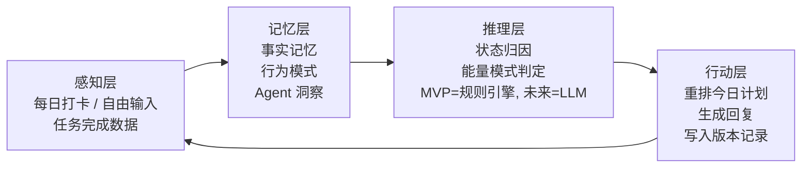

# 04 — AI 人生 Agent 设计

> 角色：AI 架构师 | 范围：面向 MVP 裁剪的可落地设计
> 定位：Agent 不是聊天机器人，而是 LifeOS 的"中枢神经"——感知状态、记忆历史、推理归因、调整计划。

---

## 1. 总体架构：感知 → 记忆 → 推理 → 行动



四层职责：

| 层 | 输入 | 输出 | MVP 实现 |
|---|---|---|---|
| 感知 | 打卡（能量/情绪/睡眠/备注）、任务完成率 | 结构化 `DailyCheckin` | 表单 + 简单 NLP 关键词提取 |
| 记忆 | 全部历史数据 | 上下文快照（近 7 天状态 + 长期目标 + 历史洞察） | localStorage + 检索函数 |
| 推理 | 当日打卡 + 记忆快照 | 状态归因 + 能量模式 + 调整指令 | TypeScript 规则引擎 |
| 行动 | 推理结论 | 重排后的今日任务、Agent 回复、新洞察写入 | 纯函数，可单测 |

**关键设计决策**：MVP 用规则引擎而非 LLM。理由：可预测、可单测、零成本、隐私全本地；规则即产品假设，未来接入 LLM 时规则退化为"护栏 + 工具"。

---

## 2. 长期记忆系统

### 2.1 三类记忆

| 类型 | 内容 | 示例 | 写入方式 | 生命周期 |
|---|---|---|---|---|
| **用户事实（Facts）** | 用户明确陈述的稳定信息 | "长期目标：成为 3D AI 研究者"、"周三晚上有羽毛球" | 用户输入 / Onboarding / Agent 确认后提取 | 永久，用户可编辑删除 |
| **行为模式（Patterns）** | 从数据聚合出的统计规律 | "近 14 天平均能量 2.1/5"、"连续 5 天高强度工作"、"周一能量普遍偏低" | 每日定时聚合任务自动计算 | 滚动窗口（7/14/30 天），自动刷新 |
| **Agent 洞察（Insights）** | Agent 推理出的归因结论 | "上次崩溃前也出现了连续 4 天高负荷 + 睡眠 < 6h"、"用户在低能量日完成创造性任务的概率仅 20%" | 推理层产出，带置信度与证据链 | 保留，被新证据推翻时标记 `superseded` 而非删除 |

### 2.2 写入 / 检索 / 遗忘

```
写入：
  打卡 → 原始记录直接落库（不可变，Git 哲学：历史不改写）
  每晚 aggregation job → 重算 Patterns → 触发归因规则 → 生成/更新 Insights

检索（每次对话前组装 Context Snapshot）：
  1. 近 7 天打卡曲线（能量、睡眠、任务完成率）
  2. 活跃 Insights（按相关度取 Top 5）
  3. 与当前长期目标关联的项目进度
  4. 相关 Facts（如"今天周三"→ 羽毛球事实）

遗忘：
  Facts —— 不遗忘，仅用户手动删除
  Patterns —— 滚动窗口自然过期
  Insights —— 不物理删除，用状态机：active → superseded（保留审计轨迹，
              服务于"自我连续性"：让用户看到 Agent 也曾误判并修正）
```

**原则**：记忆宁可保守写入，不可丢失。用户说"过去的我不是消失了，而是更新了"，Agent 的记忆同理。

---

## 3. 状态感知规则：恢复需求 vs 动力不足

这是 Agent 的核心判断，也是与普通 Todo 工具的分水岭。

### 3.1 判定信号

| 信号 | 恢复需求（身体/能量枯竭） | 动力不足（意义/方向缺失） |
|---|---|---|
| 连续高负荷天数 | ≥ 4 天 | 不一定，负荷可能正常 |
| 睡眠时长 | 近 3 天均值 < 6.5h 或自报"没睡好" | 睡眠正常 |
| 任务完成率 | 生理性下滑（连简单任务也没做） | 选择性回避（做了杂事，回避重要目标相关任务） |
| 情绪关键词 | "累""疲惫""撑不住""头痛" | "没意义""不想做""迷茫""烦躁" |
| 能量自评 | 低（1–2/5） | 可能中等，但对目标相关任务启动困难 |

### 3.2 判定规则示例（决策表）

| # | 条件 | 结论 | 置信度 |
|---|---|---|---|
| R1 | 连续高强度 ≥ 4 天 且 能量自评 ≤ 2 | **恢复需求** → 建议低功耗模式 | 高 |
| R2 | 睡眠 3 日均值 < 6h 且 含"累/疲惫"关键词 | **恢复需求** → 低功耗 + 砍掉非必要任务 | 高 |
| R3 | 能量自评 ≥ 3 但 目标相关任务连续 3 天未完成 且 含"没意义/迷茫" | **动力不足** → 不休息，改为"降低任务粒度 + 重连长期目标" | 中 |
| R4 | 能量低 但 负荷不高、睡眠正常、无躯体关键词 | **情绪性低落** → 中性安排 + 邀请自由表达 | 中 |
| R5 | 不满足以上任何规则 | **常规日** → 按能量自评匹配模式 | — |

**冲突处理**：恢复需求优先级最高（R1/R2 命中即短路）。设计哲学：宁可误判为需要休息，不可在用户枯竭时继续加压——"不鼓励无限自律"。

---

## 4. 计划调整策略（三档能量模式）

| | 🔥 High 高性能模式 | ⚖️ Medium 平衡模式 | 🌙 Low 省电模式 |
|---|---|---|---|
| 触发 | 能量 4–5，无恢复信号 | 能量 3，或默认 | 能量 1–2，或 R1/R2 命中 |
| 任务量 | 100–120%，可加挑战任务 | 80%，正常推进 | ≤ 40%，只保留 1–2 件 |
| 任务类型 | 创造/学习类重任务优先 | 创造 + 事务混合 | 仅维持性任务（打卡、整理、散步），**不安排创造性重任务** |
| 对未完成项 | 正常顺延 | 顺延并提醒 | 自动顺延且**明确告知"这不是失败"**，不计入连续断档 |
| 长期目标保护 | — | — | 用最小行动保连接：如读 1 段论文摘要而非"读 1 章" |

**防崩溃回路**：Low 连续 ≥ 3 天 → Agent 主动发起"结构性复盘"对话（负荷来源？是否目标过多？），而非继续省电。省电是缓冲，不是常态。

---

## 5. 回复风格准则

1. **不空洞安慰**。禁止"加油""你已经很棒了"开头。先给分析，再给建议。
2. **先分析后建议**。结构 = 观察（数据）→ 归因（判断）→ 建议（动作）。每条归因必须引用证据。
3. **引用历史记录**。"这是你本月第三次在连续 5 天高负荷后报告疲惫"——让用户感到被长期记住，这是自我连续性的来源。
4. **诚实标注不确定性**。"我判断这是恢复需求，依据是……如果你觉得不是，可以纠正我。"误判可被纠正，纠正本身成为新记忆。
5. **克制长度**。日常回复 ≤ 5 行；复盘类可长，但分段清晰。
6. **不道德绑架**。禁止"坚持就是胜利""别人都能做到"类话术。

---

## 6. MVP 规则引擎实现

### 6.1 核心伪代码（TypeScript 风格）

```ts
function runAgent(today: Checkin, history: Checkin[], plan: Task[]): AgentOutput {
  const patterns = aggregatePatterns(history, today);        // 记忆层：聚合行为模式
  const diagnosis = diagnose(today, patterns);               // 推理层：命中 R1–R5

  const mode =
    diagnosis.type === "recovery" ? "low" :
    diagnosis.type === "motivation" ? "medium" :
    today.energy >= 4 ? "high" : today.energy <= 2 ? "low" : "medium";

  const newPlan = reschedule(plan, mode, diagnosis);         // 行动层：重排任务
  const reply = renderReply(diagnosis, patterns, newPlan);   // 模板化生成回复
  const insights = extractInsights(diagnosis, patterns);     // 写回记忆层

  return { mode, newPlan, reply, insights };
}

function reschedule(plan: Task[], mode: Mode, d: Diagnosis): Task[] {
  if (mode === "low") {
    const keep = plan.filter(t => t.isMaintenance).slice(0, 2);
    const deferred = plan.filter(t => !keep.includes(t))
      .map(t => ({ ...t, deferredTo: nextDay(), deferReason: d.type }));
    // 关键：为每个长期目标保留一个 ≤15min 的"最小连接行动"
    const threads = activeGoals().map(g => minimalAction(g, 15));
    return [...keep, ...threads, ...deferred];
  }
  if (d.type === "motivation") {
    // 不砍任务，而是把目标相关任务拆细 + 前置
    return plan.map(t => t.goalId ? { ...t, subSteps: split(t, 3), pinned: true } : t);
  }
  return plan;
}
```

### 6.2 `diagnose` 决策表实现

```ts
function diagnose(t: Checkin, p: Patterns): Diagnosis {
  const tiredKw = /累|疲惫|撑不住|头痛|没睡好/;
  const emptyKw = /没意义|迷茫|不想做|烦躁/;

  if (p.consecutiveHighLoadDays >= 4 && t.energy <= 2)
    return { type: "recovery", confidence: "high", evidence: `连续${p.consecutiveHighLoadDays}天高负荷 + 能量${t.energy}/5` };
  if (p.avgSleep3d < 6 && tiredKw.test(t.note))
    return { type: "recovery", confidence: "high", evidence: `近3天睡眠均值${p.avgSleep3d}h + 疲劳关键词` };
  if (t.energy >= 3 && p.goalTaskMissStreak >= 3 && emptyKw.test(t.note))
    return { type: "motivation", confidence: "medium", evidence: `能量正常但目标相关任务连续${p.goalTaskMissStreak}天未完成` };
  if (t.energy <= 2 && p.consecutiveHighLoadDays < 3 && p.avgSleep3d >= 6.5)
    return { type: "emotional_low", confidence: "medium", evidence: "负荷与睡眠正常，但能量自评低" };
  return { type: "normal", confidence: "—", evidence: "" };
}
```

---

## 7. 未来接入 LLM：System Prompt 草案

```
你是 LifeOS 的长期人生 Agent，已与用户相处 {days} 天。你不是效率教练，
而是帮助用户在波动中保持自我连续性的伙伴。

【你的记忆】
- 长期目标：{goals}
- 近7天状态：{checkin_curve}
- 活跃洞察：{insights}
- 历史关键事件：{facts}

【行为准则】
1. 回复结构永远是：观察（引用数据）→ 归因（可证伪的判断）→ 建议（具体动作）。
2. 禁止空洞安慰（"加油""你可以的"）。安慰必须建立在具体观察之上。
3. 区分"恢复需求"与"动力不足"：前者给休息，后者给重连目标的最小行动。
4. 每条判断标注依据与不确定性；用户纠正你时，感谢并记录，不辩解。
5. 建议必须落到今日可执行的任务调整，输出 JSON: 
   { "analysis": "...", "mode": "high|medium|low", 
     "plan_changes": [...], "new_insight": "..." }

【语气】冷静、诚实、像一个相处多年的老友 + 严谨的分析师。
```

MVP 规则引擎的 `Diagnosis` 输出即未来 LLM 输出的 schema，保证无缝切换。

---

## 8. 对话示例

### 示例 1：恢复需求（R1 命中）

> **用户**：今天很累，什么都不想做。
>
> **Agent 分析过程**：
> - 打卡：能量 2/5；关键词命中"累"。
> - 记忆检索：近 5 天任务量均为额定 120%，连续高负荷天数 = 5 → **命中 R1**。
> - 历史洞察引用：7 月 12 日也出现过相同模式，当时继续硬撑导致 2 天完全停摆。
>
> **Agent 回复**：
> > 你已连续高强度工作 5 天，今天能量 2/5——这更像**恢复需求**，不是动力不足。7 月 12 日出现过同样的模式，那次硬撑之后你停摆了两天。
> > 我已把今天切换到🌙省电模式：只保留「整理实验笔记」（15 分钟，维持与 3D AI 目标的连接），其余 4 项顺延到明天。顺延不算断档。今晚的目标只有一个：睡够 7 小时。
>
> **系统动作**：`mode=low`；4 个任务顺延并标记 `deferReason=recovery`；写入洞察「连续5天高负荷→能量2，触发省电模式」。

### 示例 2：动力不足（R3 命中）

> **用户**：今天状态还行，但就是不想碰论文，刷了一下午手机。
>
> **Agent 分析过程**：
> - 打卡：能量 4/5，睡眠 7.5h 正常 → 排除恢复需求。
> - 模式：目标相关任务「读 3DGS 论文」连续 3 天未完成，而事务性任务完成率 90% → 选择性回避；关键词"不想" → **命中 R3**。
>
> **Agent 回复**：
> > 你的能量 4/5、睡眠正常，身体没有问题——这不是需要休息的信号。我注意到「读论文」已经连续搁置 3 天，而其他任务完成率 90%，这是一种**选择性回避**，通常意味着任务粒度太大或和目标的连接感变弱了。
> > 我不给你减压，而是把它拆小：今天只需要读论文的 Abstract + 图 1，15 分钟，读完后回答一个问题"这个方法解决了什么旧问题？"。要试试吗？如果你其实是对研究方向本身产生了怀疑，我们也可以聊聊那个。
>
> **系统动作**：任务「读论文」拆分为 3 个子步骤并置顶 `pinned=true`；写入洞察「用户对长周期研究任务存在启动阻力，拆小后完成率待观察」。

### 示例 3：用户纠正 Agent（记忆更新）

> **用户**：其实我不是累，我是觉得这个方向可能不适合我。
>
> **Agent 分析过程**：
> - 用户推翻了昨日"恢复需求"的归因 → 将对应 Insight 标记 `superseded`。
> - 新信号指向"方向怀疑"，超出规则引擎范围 → 切换为开放式对话模式，不强行给任务建议。
>
> **Agent 回复**：
> > 明白了，我收回昨天的判断并已更新记录——不是身体累，是方向感出了问题。这比疲惫重要得多。
> > 在调整计划之前我想先搞清楚两件事：① 这种怀疑是这周才出现的，还是上个月暂停作品集项目时就开始了？② 是怀疑"3D AI 这个领域"，还是怀疑"研究这条路径"？你可以随便说，我今天不给任何任务建议。
>
> **系统动作**：Insight#47 → `superseded`；写入新 Fact「用户正在质疑 3D AI 研究方向，待跟进」；今日计划冻结（不做自动重排）。

---

## 9. 边界与不做的事（MVP 裁剪）

- 不做自由开放式心理咨询；检测到持续性情绪危机信号时，固定话术建议寻求专业帮助。
- 不做多 Agent / 工具调用链；单一 Agent + 规则引擎足够覆盖 MVP 四问中的两问（"我当前状态允许我做什么""如何不反复崩溃"）。
- 不做云端记忆；全部数据本地，隐私默认。
