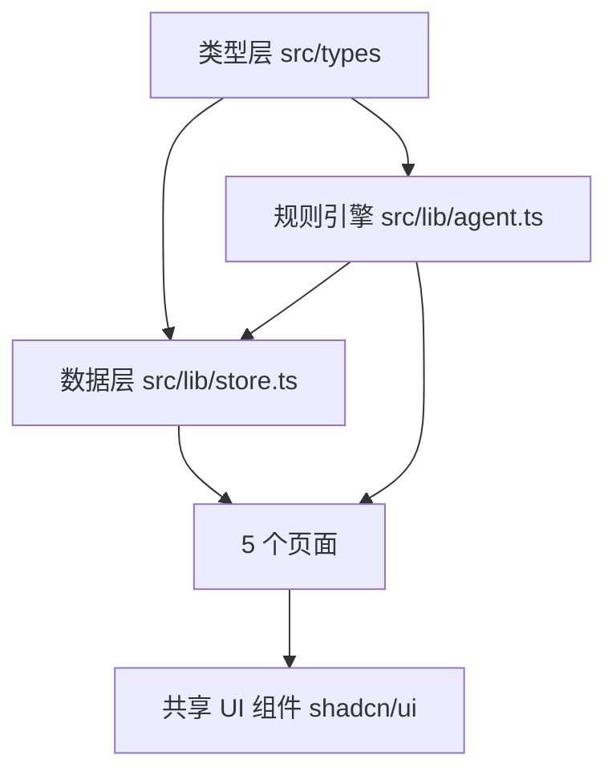
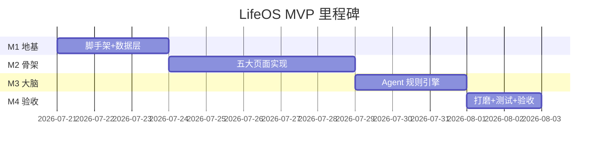

# LifeOS — MVP 开发计划（05）

> 版本：v1.0 · 定位：技术负责人视角的可落地计划
> 一句话原则：**先用最小闭环验证"状态输入 → AI 理解 → 计划调整 → 成长可见"这条价值链，其余全部延后。**

---

## 1. MVP 范围定义

MVP 只做一件事：让一个用户每天花 3 分钟记录状态，AI 给出基于上下文的计划调整建议，一周后能看到自己的轨迹。五个核心用户能力及其验收标准如下：

### 1.1 能力清单与验收标准

| # | 用户能力 | 用户故事 | 验收标准（可测试） |
|---|---------|---------|------------------|
| C1 | 输入长期目标 | 作为新用户，我要录入我的长期方向与阶段目标，让系统知道"我往哪走" | Onboarding ≤ 5 步完成；支持长期愿景 + 阶段目标（月/年）+ 近期项目三级录入；数据落库后刷新页面不丢失；空目标时系统给出引导模板 |
| C2 | 每日状态记录 | 作为用户，我要每天快速记录能量/身体/情绪等状态 | 单次记录 ≤ 60 秒（滑杆/点选为主，禁止强制打字）；覆盖 6 个状态维度（能量/身体/情绪/社交/创造/学习）+ 一句自由文本；支持当日多次修改，只保留当日最终态 |
| C3 | AI 理解状态变化 | 用户说"今天很累"时，系统不安慰而是结合历史做分析 | 规则引擎能识别 ≥ 5 类输入意图（疲劳/低落/兴奋/迷茫/常规汇报）；分析结果必须引用历史数据（如"你已连续高强度 5 天"）；输出区分"恢复需求"与"动力不足"两种判断 |
| C4 | 自动调整计划 | 根据状态分析，系统调整当天行动建议 | 能量三档（High/Medium/Low）联动今日任务列表：Low 档自动降级为"低功耗模式"（仅保留 1-2 个维护性行动）；用户可一键采纳或拒绝，采纳后写回今日计划 |
| C5 | 查看成长轨迹 | 我要看到"过去的我没有消失，而是更新了" | 时间线页以 Git commit 风格展示版本记录；支持手动生成"月度版本"（发生了什么/获得了什么/放弃了什么三段式）；状态面板展示近 7/30 天趋势（图表化） |

### 1.2 明确不做（Out of Scope）

- ❌ 真实 LLM 接入（V1.1 再做，MVP 用规则引擎模拟 Agent 行为）
- ❌ 账号体系 / 多端同步 / 云端存储（MVP 单机 localStorage）
- ❌ 社交、分享、协作功能
- ❌ 知识与项目系统的自动关联（MVP 仅做目标三级结构，不做图谱推理）
- ❌ 移动端原生 App（响应式 Web 即可）
- ❌ 打卡、 streak、积分等"自律绑架"式 gamification（违背产品原则）

---

## 2. 技术选型及理由

| 层 | 选型 | 理由 | 不选什么 |
|----|------|------|---------|
| 框架 | **React 18 + TypeScript + Vite** | 生态最成熟、类型安全保证数据模型演进时编译期报错；Vite 秒级热更新，适合快速迭代 | Next.js（无 SSR/SEO 需求，徒增复杂度） |
| UI | **Tailwind CSS + shadcn/ui** | 原子化 CSS 快速实现"暗色操作系统"质感；shadcn/ui 组件可复制进仓库自由改造，无黑盒依赖 | AntD/MUI（视觉风格重，改造成"游戏面板"质感成本高） |
| 持久化 | **localStorage + 自研 store（Zustand）** | MVP 无后端，localStorage 5MB 足够存一年的状态记录（估算见下）；Zustand 轻量（<1KB）且天然支持 persist 中间件 | IndexedDB（API 繁琐，MVP 数据量用不上）；Redux（样板代码过多） |
| AI Agent | **规则引擎（确定性状态机 + 意图匹配）** | MVP 验证的是"交互闭环"而非"模型智能"；规则引擎可预测、可测试、零成本零延迟，且规则集未来可直接转为 LLM 的 system prompt 素材 | 直接接 LLM（成本、延迟、不可控，且会掩盖交互设计问题） |
| 图表 | **Recharts** | React 原生、声明式，画状态趋势折线/雷达图够用 | ECharts（功能过剩、包体积大） |
| 测试 | **Vitest（单元）+ 手动验收清单（E2E）** | Vite 原生集成 Vitest；MVP 阶段人工走查比自动化 E2E 性价比高 | Playwright（V1.1 稳定后再引入） |

**存储量估算**：单条每日状态记录 ≈ 300B（JSON），一年 365 天 ≈ 110KB；目标 + 版本记录 + 对话历史 ≈ 500KB 上限。localStorage 5MB 限额下余量充足。当数据接近 3MB 时触发导出提醒（V1.1 云同步前的过渡方案）。

### 模块依赖图



约束：页面只能通过 store 读写数据、通过 agent 获取分析，**禁止页面间直接耦合**。

---

## 3. 开发里程碑

总周期按 4 个里程碑推进，每个里程碑结束必须可演示（Stage-Gate）。



### M1 — 脚手架 + 数据层（核心：契约先行）

**任务拆解**
1. 用 Vite 初始化 React+TS 项目，接入 Tailwind + shadcn/ui，定义设计 tokens（暗色暖调、琥珀/橄榄强调色）
2. 编写 `src/types/`：UserState / Goal（三级）/ EnergyMode / LifeVersion / AgentMessage 全部 TS 类型
3. 实现 `src/lib/store.ts`：Zustand + persist 中间件，含 seed 数据（示例用户）
4. App 外壳：侧边导航 + 5 个路由占位页 + 404
5. 数据迁移机制：`schemaVersion` 字段 + migrate 函数骨架（为 V1.1 结构演进留口）

**风险与对策**
- ⚠️ 数据模型返工 → 类型评审在写页面前强制完成，类型文件单独提交评审
- ⚠️ shadcn/ui 暗色主题适配问题 → M1 内先做出"角色面板卡片"一个样板组件验证视觉

**出口标准**：`npm run build` 通过；刷新后 seed 数据可增删改且不丢。

### M2 — 五大页面（核心：独立可并行）

| 页面 | 关键内容 | 预估 |
|------|---------|------|
| HomePage 角色面板 | 6 维状态展示（非打分，用文字描述如"身体恢复不足"）+ 近 7 天趋势雷达图 | 1.5d |
| LifeMapPage 人生地图 | 长期→阶段→项目→今日 的纵向对齐树/星图，支持编辑 | 1.5d |
| TodayPage 今日模式 | 能量三档切换 + 今日行动列表（此时建议为静态占位） | 1d |
| TimelinePage 时间线 | Git commit 风格版本列表 + "生成月度版本"表单（三段式） | 1d |
| ChatPage AI 对话 | 对话 UI + 输入区（此时回复为 echo 占位） | 0.5d |

**风险与对策**
- ⚠️ 人生地图视觉化范围蔓延（想做成无限画布）→ **裁剪为静态树状布局**，不做拖拽缩放，V1.1 再升级
- ⚠️ 5 人并行改共享组件冲突 → 共享组件冻结在 M1，页面只读使用；新共享需求走评审

**出口标准**：5 页全部路由可达、数据读写真实（非 mock）、构建零警告。

### M3 — Agent 规则引擎（核心：产品的灵魂）

**任务拆解**
1. 意图识别器：关键词 + 正则 + 否定词处理（"不累"≠"累"），覆盖 C3 要求的 5 类意图
2. 上下文分析器：读取近 7 天状态序列，产出结构化判断（连续高强度天数 / 趋势方向 / 维度失衡）
3. 策略决策器：判断结果 → 能量模式建议 → 今日任务降级/升级规则
4. 回复生成器：模板槽填充，语气 = "冷静的战友"，禁止空洞安慰；每条分析必须带数据引用
5. 与 TodayPage 打通：采纳/拒绝按钮真实写回计划

**规则示例**

```text
IF 连续3天以上 energy<=2 AND 用户输入含("累","疲惫","撑不住")
THEN 判断 = "恢复需求（非动力不足）"
     建议 = 切换 Low 模式，今日仅保留 ≤2 个维护性行动
     话术 = "你已连续高强度工作 {n} 天，这更像恢复需求而非动力不足。
             建议进入低功耗模式，今天只保留 {行动}。"
```

**风险与对策**
- ⚠️ 规则引擎回复生硬、像表单 → 每类意图准备 3 套话术模板轮换 + 插入用户真实数据；评审时做"盲测"：让非开发者读回复，判断是否"像有人在理解我"
- ⚠️ 误判（用户开玩笑被当成崩溃预警）→ 所有自动调整**必须用户确认**，Agent 只建议不执行

**出口标准**：C3/C4 验收用例全部通过；意图识别测试集（≥ 30 条）准确率 ≥ 85%。

### M4 — 打磨 + 验收

**任务拆解**：视觉走查（设计原则符合度）、空状态/边界态补全（新用户无数据时的引导）、性能检查（首屏 < 2s）、构建优化、完整走查测试清单。

**风险**：打磨时间膨胀 → 时间盒 2 天，超出的优化项一律进 V1.1 backlog。

---

## 4. 测试与验收清单

### 4.1 单元测试（Vitest）

- [ ] store：增删改查 + persist 序列化/反序列化 + schemaVersion 迁移
- [ ] agent：意图识别测试集 ≥ 30 条（含否定句、混合情绪、无关输入），准确率 ≥ 85%
- [ ] agent：连续高强度判定逻辑（边界：恰好 3 天 / 中断 1 天）

### 4.2 能力验收（对应 C1-C5）

- [ ] C1：新用户 Onboarding 5 步内完成目标录入，刷新后数据仍在
- [ ] C2：60 秒内完成一次完整状态记录；当日重复记录只保留最终态
- [ ] C3：输入"今天很累"，回复中必须出现具体历史数据引用（天数/趋势）
- [ ] C4：Low 模式下今日行动自动降级；采纳/拒绝均正确写回
- [ ] C5：时间线正确展示版本记录；可生成三段式月度版本；趋势图渲染正常

### 4.3 产品原则验收（人工走查）

- [ ] 全文案检查：无"坚持打卡""自律"" streak"等效率机器话术
- [ ] 状态面板为描述性语言（"创造力很高"），非评分排名
- [ ] Agent 所有自动调整均需用户确认，无一键强制执行
- [ ] 视觉：暗色暖调、低饱和、无蓝紫渐变、无高饱和背景

### 4.4 工程验收

- [ ] `npm run build` 零错误零警告；`npm run dev` 正常热更新
- [ ] 无 console error；路由直达各页面不白屏
- [ ] localStorage 清空后应用可重新 Onboarding（不崩溃）

---

## 5. V1.1 之后的迭代路线

```text
MVP (v1.0)              V1.1                    V1.2                    V2.0
──────────────  ─────────────────────  ─────────────────────  ─────────────────────
规则引擎 Agent    真实 LLM 接入           多端同步 + 账号体系      知识与项目图谱
localStorage      LLM 混合架构            云存储 + 冲突合并        人生地图可视化增强
单机 Web          数据导出/导入           移动端适配深化           目标-知识-机会自动关联
                  可视化增强              回顾报告自动生成         开放规则/提示词自定义
```

### V1.1 — 真实 LLM 接入（混合架构，不是替换）

- **保留规则引擎**做意图识别与安全兜底（成本为零、永远在线），LLM 只做"深度分析 + 自然语言生成"——规则引擎的判定结果作为 LLM 的结构化输入，防止模型幻觉式安慰
- MVP 积累的规则集与话术模板直接转化为 system prompt 资产，这是 MVP 阶段最重要的隐性产出
- 成本护栏：每日 LLM 调用次数上限 + 本地缓存相同上下文回复

### V1.1 — 数据可视化增强

- 状态维度相图（如"创造力高 × 身体恢复不足"的失衡象限提示）
- 人生地图升级为可缩放星图；版本时间线支持 diff 视图（"7 月版本 vs 6 月版本"）

### V1.2 — 多端同步

- 账号体系 + 云端存储；**先做导出/导入 JSON** 作为过渡，降低迁移风险
- 冲突合并策略：状态记录按时间戳 last-write-wins，目标/版本记录提示用户手动合并

### V2.0 — 知识与项目图谱

- 目标自动关联笔记/项目/学习记录（例："成为 3D AI 研究者" → 论文 → 实验 → 作品集）
- 技术前提：V1.1 的 LLM 已具备实体抽取能力，图谱构建水到渠成，**不提前设计**

---

## 6. 关键决策备忘

| 决策 | 结论 | 理由 |
|------|------|------|
| Agent 用规则引擎还是直接上 LLM | 规则引擎 | 验证交互闭环优先；规则即未来 prompt 资产 |
| 要不要后端 | 不要 | 单机闭环足够验证价值；同步是留存问题不是验证问题 |
| 人生地图做到什么程度 | 静态树 | 无限画布是 3 倍工作量，对核心闭环无贡献 |
| 自动调整的权限 | 仅建议，用户确认 | 信任是产品的核心资产，误执行一次就会摧毁它 |
